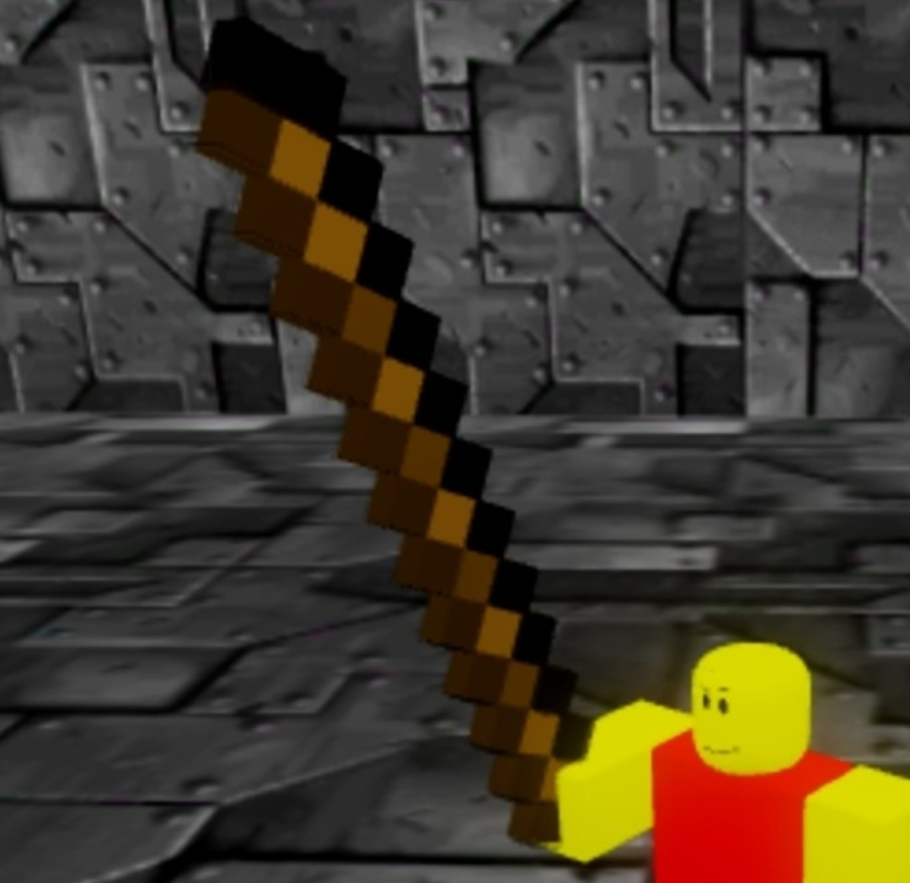
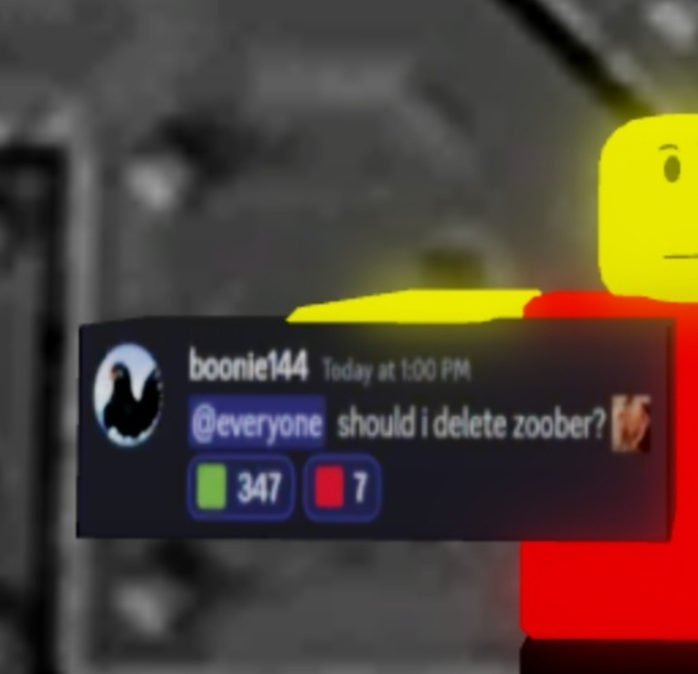

<!-- ================= РУССКИЙ ЯЗЫК ================= -->

  <h1>Вики a51bfcts</h1>
  
<em>Area 51 but find coils to survive</em>

  

  <h2>⚡ <a href="coils.html">Катушки</a></h2>
  

  <h2>🪄 <a href="wands.html">Палочки</a></h2>
  

  <h2>📦 <a href="other.html">Прочие предметы</a></h2>

<!-- ================= АНГЛИЙСКИЙ ЯЗЫК ================= -->

  <h1>Wiki a51bfcts</h1>
  
<em>Area 51 but find coils to survive</em>

  

  <h2>⚡ <a href="coils.html">Coils</a></h2>
  

  <h2>🪄 <a href="wands.html">Wands</a></h2>
  

  <h2>📦 <a href="other.html">Other Items</a></h2>

<!-- ================= ИСПАНСКИЙ ЯЗЫК ================= -->

  <h1>Wiki a51bfcts</h1>
  
<em>Area 51 but find coils to survive</em>

  

  <h2>⚡ <a href="coils.html">Bobinas</a></h2>
  

  <h2>🪄 <a href="wands.html">Varitas</a></h2>
  

  <h2>📦 <a href="other.html">Otros Objetos</a></h2>

 

<!-- КНОПКИ ПЕРЕКЛЮЧЕНИЯ ЯЗЫКОВ -->

  🇷🇺 RU | 
  🇬🇧 EN | 
  🇪🇸 ES

  <em>Kpblm4ik</em> 
  <em>boonie144</em> 
  <em>2026 ©</em> 
  <small>Защищено лицензией CC BY-NC-ND 4.0</small>

<!-- СКРИПТ ПЕРЕВОДА С ХРАНИЛИЩЕМ ПАМЯТИ -->

