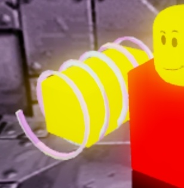

<!-- ================= РУССКИЙ ================= -->

  <h1>🏗️ Катушка призыва (Summon Coil)</h1>
  
Полное руководство по секретному артефакту лаборатории Зоны 51.

  

  

  
  <h3>📊 Игровые параметры:</h3>
  <ul>
    <li><strong>Скорость бега:</strong> 60 единиц (мощное ускорение персонажа)</li>
    <li><strong>Высота прыжка:</strong> 16 единиц (позволяет запрыгивать на ящики)</li>
  </ul>

  <h3>🔮 Особая способность:</h3>
  
При активации катушки в руке персонаж произносит скрытое заклинание и **призывает случайные блоки**. По заявлению исследователей, эти блоки абсолютно бесполезны для прохождения, но идеально подходят для фана, создания баррикад от монстров или троллинга друзей на сервере!

  <h3>🎵 Звуковое сопровождение (64 kbps):</h3>
  

    <audio controls style="width: 100%; max-width: 400px;">
      <source src="block_magic.mp3" type="audio/mpeg">
      Ваш браузер не поддерживает аудио.
    </audio>
  

<!-- ================= ENGLISH ================= -->

  <h1>🏗️ Summon Coil</h1>
  
Full guide to the secret artifact of the Area 51 laboratory.

  

  

  
  <h3>📊 Item Stats:</h3>
  <ul>
    <li><strong>Speed:</strong> 60 units (powerful character boost)</li>
    <li><strong>Jump Power:</strong> 16 units (allows you to climb on boxes)</li>
  </ul>

  <h3>🔮 Special Ability:</h3>
  
When activated in hand, the character casts a hidden spell and **summons random blocks**. According to researchers, these blocks are completely useless for finishing the game, but perfect for having fun, trolling friends, or building funny barricades from monsters!

  <h3>🎵 Item Audio (64 kbps):</h3>
  

    <audio controls style="width: 100%; max-width: 400px;">
      <source src="block_magic.mp3" type="audio/mpeg">
    </audio>
  

<!-- ================= ESPAÑOL ================= -->

  <h1>🏗️ Bobina de Invocación (Summon Coil)</h1>
  
Guía completa del artefacto secreto del laboratorio de la Área 51.

  

  

  
  <h3>📊 Estadísticas:</h3>
  <ul>
    <li><strong>Velocidad:</strong> 60 unidades (gran impulso de personaje)</li>
    <li><strong>Salto:</strong> 16 unidades (permite subir a las cajas)</li>
  </ul>

  <h3>🔮 Habilidad Especial:</h3>
  
Cuando se activa en la mano, el personaje lanza un hechizo oculto и **invoca bloques aleatorios**. Según los investigadores, estos bloques son completamente inútiles para completar el juego, ¡pero perfectos para divertirse, trollear amigos o construir barricadas contra monstruos!

 

  🇷🇺 RU | 
  🇬🇧 EN | 
  🇪🇸 ES

<a href="coils.html">🔙 Назад к Катушкам / Back to Coils / Volver a Bobinas</a>

