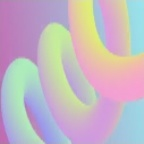

<!-- ПОДКЛЮЧАЕМ ТОПОВЫЙ ИГРОВОЙ ШРИФТ ИЗ GOOGLE FONTS -->
<link rel="preconnect" href="https://googleapis.com">
<link rel="preconnect" href="https://gstatic.com" crossorigin>
<link href="https://googleapis.com/css2?family=Rubik+Mono+One&family=Rubik:wght@900&display=swap" rel="stylesheet">

<!-- ================= РУССКИЙ ЯЗЫК ================= -->

  <h1 style="font-family: 'Rubik Mono One', sans-serif; font-size: 24px; color: #fff; text-shadow: 0 0 10px #a066ff;">🏗️ Катушка призыва</h1>
  
  

    

    

  

  <!-- КАРТОЧКА ПРЕДМЕТА -->
  

    
Катушка призыва

    
    

      
Сложность получения

      
Легко

    

    

      
🏅 Получение

      
Значок "Complex Power"

    

    <!-- РАЗДЕЛ ХАРАКТЕРИСТИКИ -->
    
Характеристики

    

      
🏃 Скорость

      
60 единиц

    

    

      
🦘 Сила прыжка

      
16 единиц

    

    <!-- РАЗДЕЛ ОСОБЕННОСТИ -->
    
Особенности

    

      
🔮 Способность

      
Спавн блоков 4х2х1 разных цветов

    

  

  <h3>📋 Описание предмета:</h3>
  
<strong>Катушка призыва</strong> — одна из четырёх катушек, для которой требуется получить значок, имеет способность призывать блоки по месту клика курсора/пальца. Имеет розово-белое свечение, сама катушка имеет розово-зелено-сине-желтый перелив.

<!-- ================= ENGLISH ================= -->

  <h1 style="font-family: 'Rubik Mono One', sans-serif; font-size: 24px; color: #fff;">🏗️ Summon Coil</h1>
  
  

    

    

  

  

    
Summon Coil

    

      
Difficulty

      
Easy

    

    

      
Obtain

      
"Complex Power" Badge

    

    
Stats

    

      
🏃 Speed

      
60 units

    

    

      
🦘 Jump Power

      
16 units

    

    
Features

    

      
🔮 Ability

      
Spawns 4x2x1 multi-colored blocks

    

  

  <h3>📋 Description:</h3>
  
<strong>Summon Coil</strong> — one of the four coils that requires a badge to obtain. It has the unique ability to summon blocks exactly where the cursor or finger clicks. Features a glowing pink and white aura, while the coil itself shifts beautifully through pink, green, blue, and yellow gradients.

<!-- ================= ESPAÑOL ================= -->

  <h1 style="font-family: 'Rubik Mono One', sans-serif; font-size: 24px; color: #fff;">🏗️ Bobina de Invocación</h1>
  
  

    

    

  

  

    
Bobina de Invocación

    

      
Dificultad

      
Fácil

    

    

      
Obtención

      
Emblema "Complex Power"

    

    
Estadísticas

    

      
🏃 Velocidad

      
60 unidades

    

    

      
🦘 Salto

      
16 unidades

    

    
Características

    

      
🔮 Habilidad

      
Invoca bloques de 4x2x1 de varios colores

    

  

  <h3>📋 Descripción:</h3>
  
<strong>Bobina de Invocación</strong> — una de las cuatro bobinas que requiere un emblema. Tiene la habilidad de invocar bloques en el lugar exacto del clic del cursor o del dedo. Tiene un brillo rosa y blanco, y la bobina misma tiene un degradado de rosa, verde, azul y amarillo.

 

<!-- КНОПКИ ПЕРЕКЛЮЧЕНИЯ ЯЗЫКОВ -->

  🇷🇺 RU | 
  🇬🇧 EN | 
  🇪🇸 ES

<a href="coils.html">🔙 Назад к Катушкам / Back to Coils / Volver a Bobinas</a>

<!-- СКРИПТ ЛОКАЛИЗАЦИИ -->

