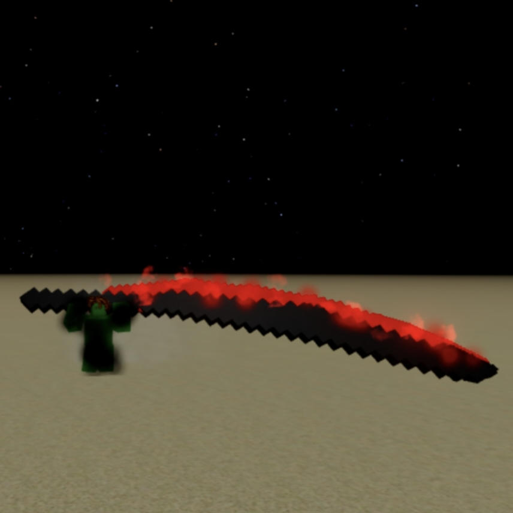

<!-- ================= РУССКИЙ ЯЗЫК ================= -->

  <h1>🪄 Раздел: Палочки (Wands)</h1>
  
Добро пожаловать в архивы магического оружия! Нажмите на карточку палочки, чтобы открыть секретное досье и координаты крафта.

  
  

    <!-- КАРТОЧКА 1: Ужасная палочка (Кликабельная кнопка) -->
    <a href="horrificwand.html" class="item-card">
      
      <h3 style="color: #ff3333;">ho_rr&c wand</h3>
      
💀 Сложность: Адская

      
🩸 Открыть секретный гайд...

    </a>

    <!-- КАРТОЧКА 2: Глитч палочка (Пока текст) -->
    

      
      <h3>glitch wand</h3>
      
👾 Сложность: ??

      
🔍 Подробнее в будущем...

    

  

<!-- ================= ENGLISH ================= -->

  <h1>🪄 Section: Wands</h1>
  
Welcome to the magic weapons archive! Click on a wand card to open the secret dossier and craft coordinates.

  
  

    <a href="horrificwand.html" class="item-card">
      
      <h3 style="color: #ff3333;">ho_rr&c wand</h3>
      
💀 Difficulty: Insane

      
🩸 Open guide...

    </a>

    

      
      <h3>glitch wand</h3>
      
👾 Difficulty: ??

    

  

<!-- ================= ESPAÑOL ================= -->

  <h1>🪄 Sección: Varitas</h1>
  
¡Bienvenido al archivo de armas mágicas! Haz clic en una tarjeta para abrir el expediente secreto.

  
  

    <a href="horrificwand.html" class="item-card">
      
      <h3 style="color: #ff3333;">ho_rr&c wand</h3>
      
💀 Dificultad: Infernal

      
🩸 Ver guía...

    </a>

    

      
      <h3>glitch wand</h3>
      
👾 Dificultad: ??

    

  

 

<!-- КНОПКИ ПЕРЕКЛЮЧЕНИЯ ЯЗЫКОВ -->

  🇷🇺 RU | 
  🇬🇧 EN | 
  🇪🇸 ES

<a href="index.html">🔙 На Главную / Back to Main / Volver al Inicio</a>

